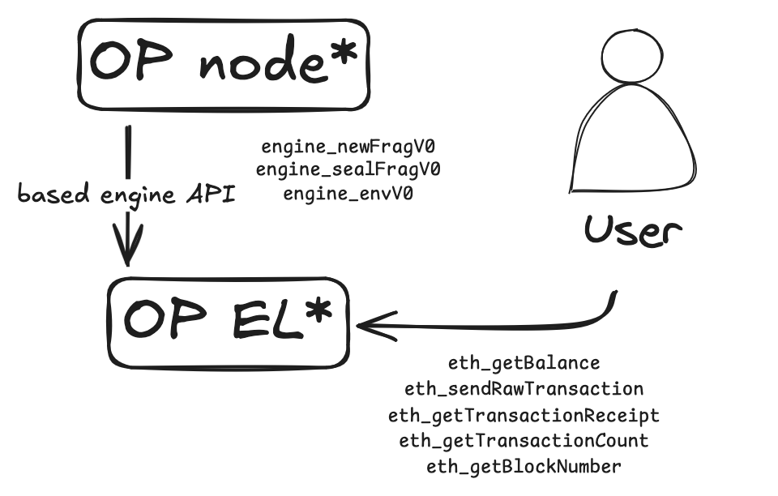

# Execution



## Unsealed Block

```go
type UnsealedBlock struct {
    Env                *Env
    Frags              []Frag
    LastSequenceNumber *uint64
    Hash               common.Hash

    Receipts Receipts
}
```

## Starting a new unsealed block

For an unsealed block to be started, we first need to receive the `engine_envV0` request from the OP node. This request will contain environment data for the new block. The requests looks like:

```go
type Env struct {
    Number           uint64
    Beneficiary      common.Address
    Timestamp        uint64
    GasLimit         uint64
    Basefee          uint64
    Difficulty       *big.Int
    Prevrandao       common.Hash
    ParentHash       common.Hash
    ParentBeaconRoot common.Hash
    ExtraData        []byte
}
```

and for it to be valid, the following conditions must be met:

- There must not be a an unsealed block in progress.
- The timestamp must be greater than the previous block's timestamp.
- The block number must be the next one in the sequence.
- The parent hash must match the previous block's hash.

Once validated, we start a new unsealed block with this data but empty of frags, last sequence number set to nil (until the first new frag arrives), hash (we cannot know the hash of a block that is not yet sealed), and receipts (there are none until we start inserting frags and executing their transactions); this is done by `NewUnsealedBlock(env *Env) *UnsealedBlock`.

After created, we need to persist it in the blockchain global state, we do this with `(bc *BlockChain) SetCurrentUnsealedBlock(ub *UnsealedBlock) error`.

## Inserting frags to the unsealed block

Once the unsealed block is started, we can start adding frags to it as long as we receive valid `engine_newFragV0` requests. These requests looks like:

```go
type Frag struct {
    BlockNumber uint64         `json:"blockNumber"`
    Seq         uint64         `json:"seq"`
    IsLast      bool           `json:"isLast"`
    Txs         []*Transaction `json:"txs"`
}
```

and for it to be valid, the following conditions must be met:

- The block number must match the current unsealed block number and there must be an opened unsealed block.
- The sequence number must be the next one in the sequence (the current unsealed block persists this number). This has several cases:
    - Before checking the sequence number is the correct one, we must make sure that the current unsealed block's last frags was not the final one (meaning this block is treated as sealed).
    - If the sequence number is 0 and the unsealed block did not received the last frag, then the frag is the first one and the current unsealed block must have the `LastSequenceNumber` set to nil.
    - If the sequence number is > 0 and the unsealed block did not received the last frag, then the frag should be the next in the sequence.


If valid, the frags are added to the unsealed block by `(bc *BlockChain) InsertNewFrag(frag *Frag) error`. This means executing every transaction in the frag and adding the receipts to the unsealed block.

If the frag is the last one, the unsealed block is considered sealed and ...

### Sealing the block

The unsealed block in progress is sealed if the seal data we've received from the OP node through the `engine_sealFragV0` request matches the local data about the unsealed block execution. If so, the unsealed block is set as canonical and now is the head of the chain. The request looks like:

```go
type Seal struct {
    TotalFrags       uint64      `json:"totalFrags"`
    BlockNumber      uint64      `json:"blockNumber"`
    GasUsed          uint64      `json:"gasUsed"`
    GasLimit         uint64      `json:"gasLimit"`
    ParentHash       common.Hash `json:"parentHash"`
    TransactionsRoot common.Hash `json:"transactionsRoot"`
    ReceiptsRoot     common.Hash `json:"receiptsRoot"`
    StateRoot        common.Hash `json:"stateRoot"`
    BlockHash        common.Hash `json:"blockHash"`
}
```

To successfully seal the block, our current unsealed block execution state must match with the following conditions:

- The total frags must match the number of frags we've received.
- The block number must match the current unsealed block number.
- The gas used must match the sum of the gas used in the receipts.
- The gas limit must match the gas limit in the environment.
- The parent hash must match the parent hash in the environment.
- The transactions root must match the root of the transactions trie.
- The receipts root must match the root of the receipts trie.
- The state root must match the root of the state trie.
- The block hash must match the hash of the block.

