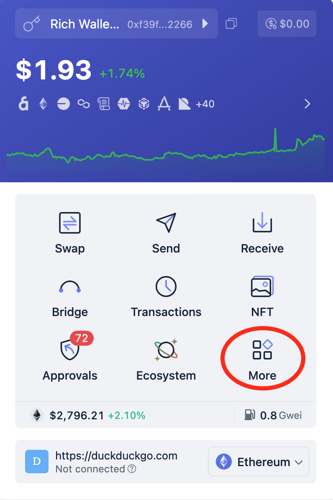
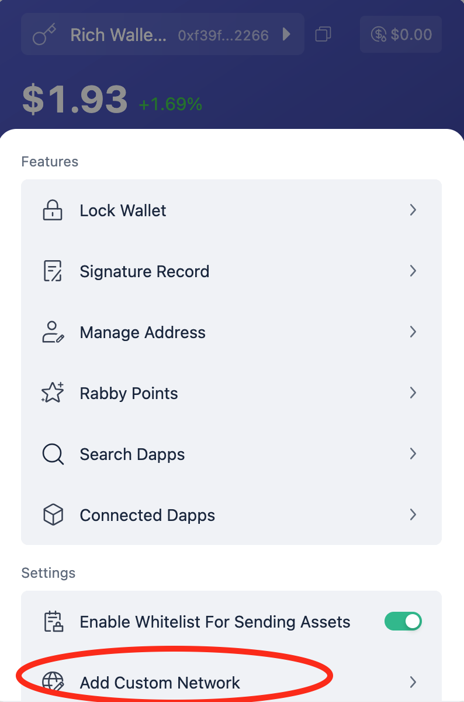
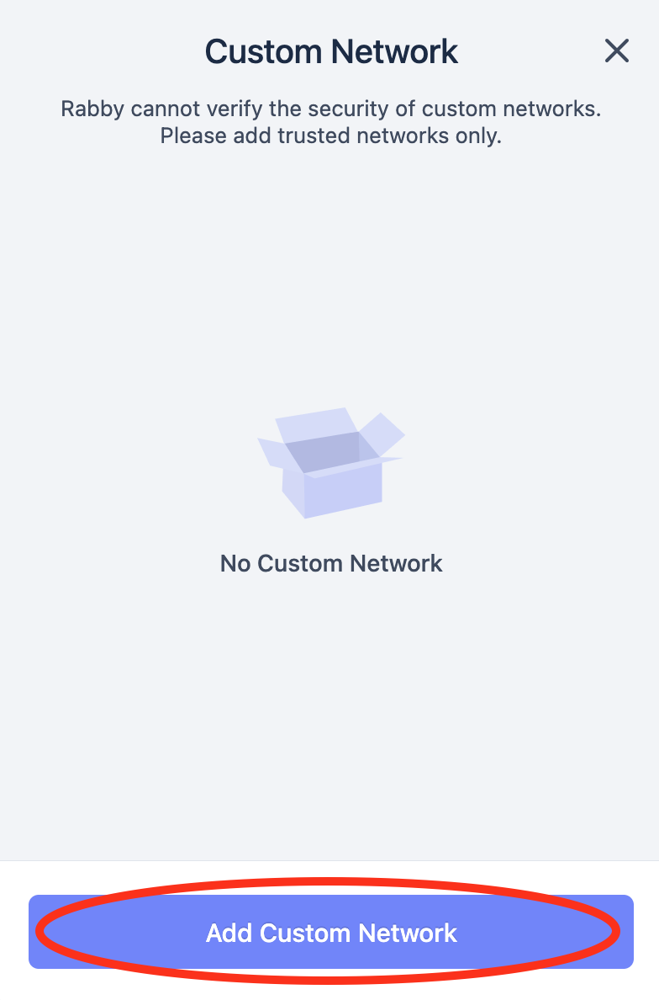
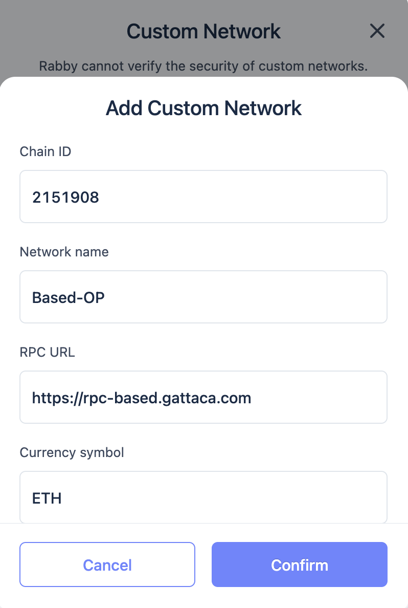
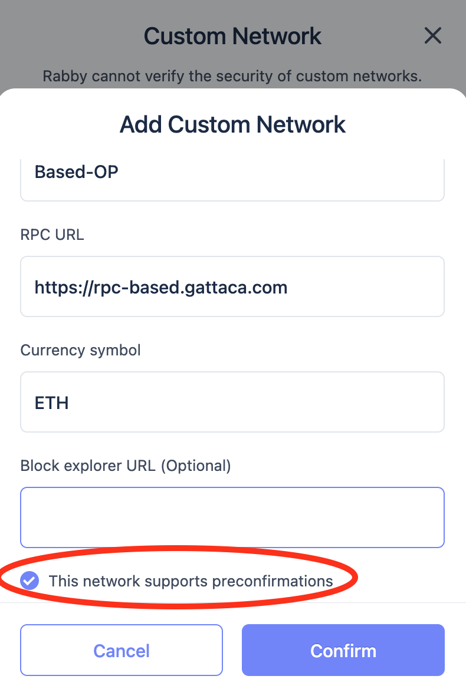
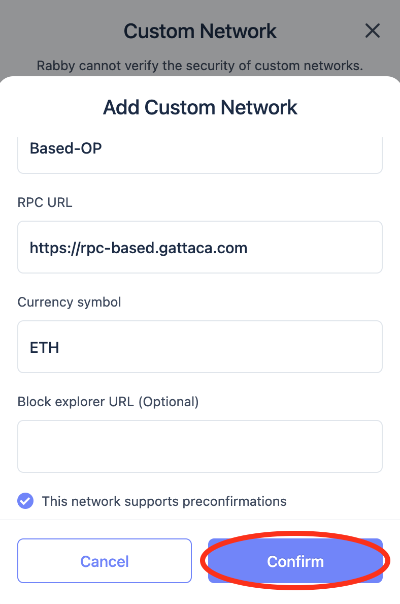

# Get Started

## Prerequisites

Before you start, make sure you have the following installed on your machine:

- [Docker](https://docs.docker.com/get-docker/)
- [Make](https://www.gnu.org/software/make/)
- [Kurtosis CLI](https://docs.kurtosis.com/install/) (installed later in the setup process)

For local development, you will also need:
- [Go](https://golang.org/dl/)
- [Rust](https://www.rust-lang.org/tools/install)

### Quick Start

Clone the repo at: https://github.com/gattaca-com/based-op and use the following command to download the dependencies, build, and run the project:

```shell
make deps build run
```

All the components, including sequencer, gateway, portal, and follower nodes will start in a new kurtosis enclave.
You can now test sending a transaction with `make test-tx`.
The transaction will be sent to the Portal, and forwarded to the gateway, which will sequence the transaction in a new Frag, and broacast it via p2p to follower nodes.
The Portal is only temporarily acting as a multiplexer for `eth_` calls, but we don't expect this to be in the final design.

#### Logging

To view the logs, run the following:

```shell
make gateway-logs            // Based gateway logs
make portal-logs             // Based portal logs
make op-node-logs            // OP node logs
make op-reth-logs            // OP reth logs
```

## Join our devnet

### Build and Install Modified Rabby Wallet

Wallets commonly use a high polling interval for the transaction receipt. To be able to see the preconfirmation speed, we've modified Rabby to speed up that interval. You can test it by compiling it:

```sh
make build-rabby
```

And importing it to your browser locally (see [Firefox](https://extensionworkshop.com/documentation/develop/temporary-installation-in-firefox/) or [Chrome](https://developer.chrome.com/docs/extensions/get-started/tutorial/hello-world?hl=es-419#load-unpacked) references). The compiled extension directory is `rabby/dist` for Google Chrome, and `rabby/dist-mv2` for Mozilla Firefox.

### Adding the devnet as a Rabby custom network

To access our devnet, you will need to add the network to your modified wallet.

To manually add the network, follow these steps:

1. Log into your Rabby wallet, click on the **More** button near the bottom right corner.



2. Click on the **Add Custom Network** below the **Settings** section.



3. Click in **Add Custom Network**



4. Fill in the form with the following values:
    - Chain ID: `2151908`
    - Network Name: `Based-OP`
    - RPC URL: `https://rpc-based.gattaca.com`
    - Currency Symbol: `ETH`
    - Block Explorer URL: `https://blockscout.com/poa/xdai`



5. Toggle the **This network supports preconfirmations** option.



6. Click on **Confirm**.



You can now use the wallet to interact with the Based-OP devnet. Read the section below to learn how to witness preconfirmations.

### Witnessing Preconfirmations


