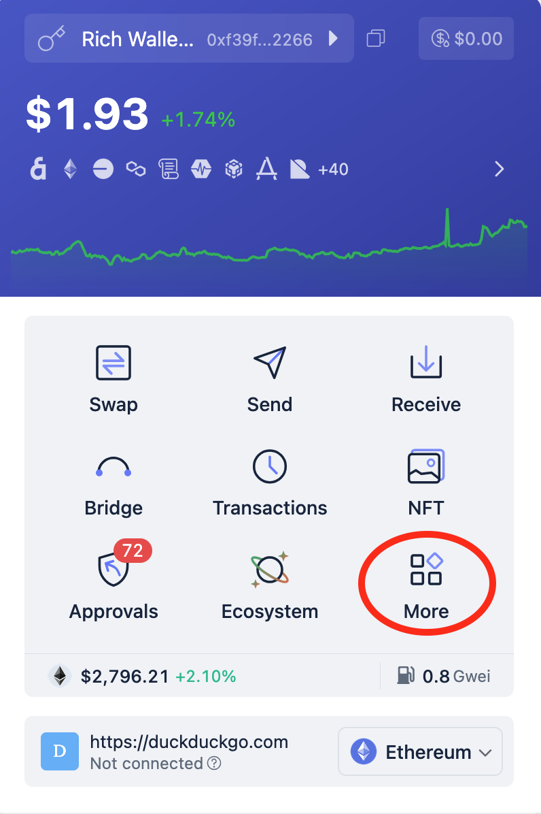
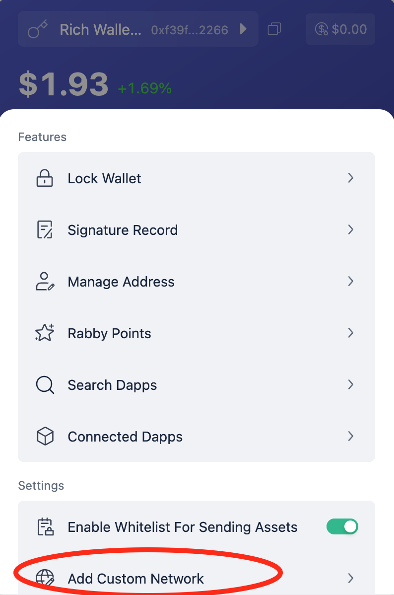
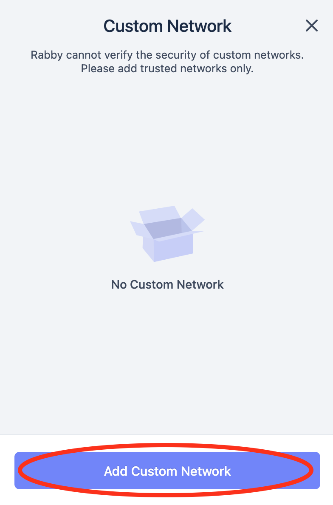
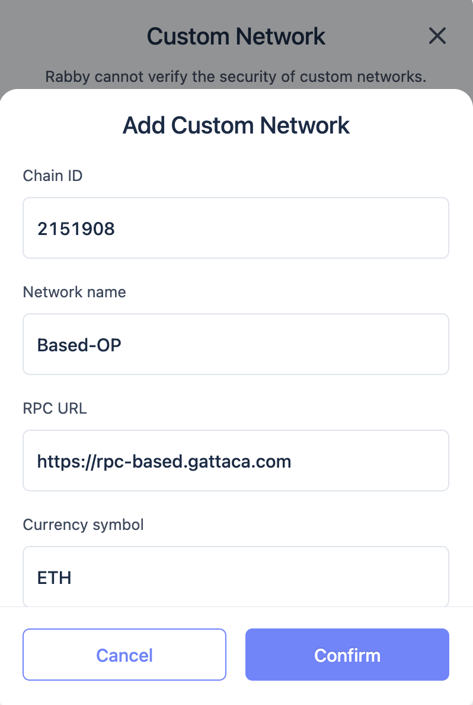
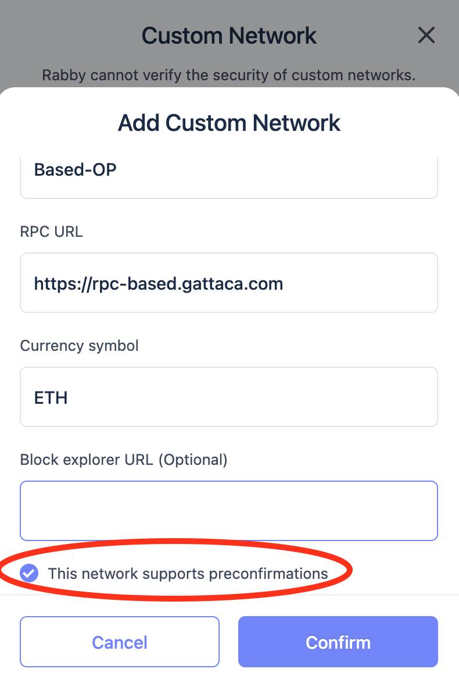
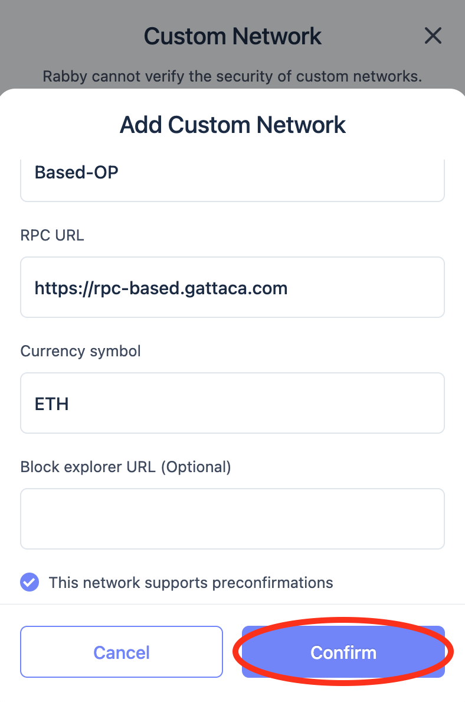

# Try out Based OP

You can try out a Based OP testnet following the steps below.

### Network Details

| Parameter       | Value                               |
| --------------- | ----------------------------------- |
| Chain ID        | 29866                               |
| Network Name    | Based-OP                            |
| Currency Symbol | opETH                               |
| RPC URL         | https://based-rpc.gattaca.com       |
| Block Explorer  | https://based-explorer.gattaca.com/ |
| Break My Frags  | https://based-bmf.gattaca.com/      |

## Break My Frags

We have created a tool at [based-bmf](https://based-bmf.gattaca.com/) to experiment with the latencies and throughput of our `Based OP` testnet.
It interfaces with a `Based OP`/`Frag` enabled `op-geth` rpc using the standard `eth_...` calls. Using one of the rich wallets, a user can get a new wallet
generated with a small amount of Eth deposited to it. Transactions can then be generated and sent automatically, while the latency for receiving the
`Receipt`, confirming the success of the transaction, is tracked and displayed. `Auto Send` triggers a spammer that will continuously send transactions.

Our current testnet setup is mainly focused on robustness and thorough testing of different scenarios.
As such it is structrured as follows:

- A vanilla `op-node` and `op-geth`, with a `Portal` in between, are driving the chain forward on a box in Europe.
- Multiple sequencing `Gateways` are setup to take turns sequencing a number of future blocks
  - On the same box
  - In the same region
  - In the US east region
  - A varying number in the UK on WiFi
- `Gateways` gossip `Frags`, i.e. ~`200ms` partial blocks that have been committed to
- The `Gateway` on the same box as the main `op-node` and `op-geth` serves as the main RPC
- Txs are gossiped around, `Frags` arrive back, and the `Gateway` serves `Receipts` based on those

This setup means that the total latency to receive `Receipts` will vary depending on which `Gateway` is currently sequencing:

- 80-150 ms on the same box
- 200-350 ms for same region
- 500-700 ms when in different regions
- 200-700 ms for the last category of `Gateways`, depending on the WiFi

## Run a local Gateway

### Prerequisites

You will need a box with globally open ports:

- 9997 (tcp)
- 9103 (tcp/udp)
- 31303 (tcp/udp)

### Gateway Setup

In the following, all defaults are set up to target the [`Based OP` testnet](https://based-explorer.gattaca.com), deployed on top of mainnet Sepolia.
With that default config, a new `private-key` and `wallet` combo will be generated which your `Gateway` will use to sign `Frags`.
The `wallet` is communicated back to the `Portal` to be gossiped around to the rest of the network for signature verification.

The following single command sets up everything and will start your `Gateway`, `Based OP-node`, `Based OP-geth`:
`git clone https://github.com/gattaca-com/based-op && cd based-op && make start-gateway`

If everything went well, you should see a terminal UI appear, called the `Overseer`:

This shows you the status of your local `Gateway` and a general overview of the chain.
You can press left and right keys to cycle between the different tabs and explore all the information!

The configuration that was generated can be found in `based-op/.local_gateway_and_follower`, mainly the `.env` and `compose.yml` files.

When you [spam some transactions with `based-bmf`](https://based-bmf.gattaca.com), you should see them appear in the `Transaction Pool` of your `Gateway`.

A couple of commands tend to come in handy (from the top `based-op` directory):

- `make stop-gateway`
- `make start-gateway`
- `make start-overseer`
- `make logs-gateway`
- `make logs-based-op-node`
- `make logs-based-op-geth`

> **⚠️ Experimental**  
> The following section may not 100% work as described below

## Connecting a Wallet

Wallets commonly use a high polling interval for the transaction receipt. To be able to see the preconfirmation speed, we've modified Rabby to speed up that interval.

### Build and Install Modified Rabby Wallet

You can test it by compiling it:

```sh
make build-rabby-chrom
```

And importing it to your browser locally (see [Firefox](https://extensionworkshop.com/documentation/develop/temporary-installation-in-firefox/) or [Chrome](https://developer.chrome.com/docs/extensions/get-started/tutorial/hello-world#load-unpacked) references). The compiled extension directory is `rabby/dist` for Google Chrome, and `rabby/dist-mv2` for Mozilla Firefox.

### Adding the devnet as a Rabby custom network

To access our devnet, you will need to add the network to your modified wallet.

To manually add the network, follow these steps:

1. Log into your Rabby wallet, click on the **More** button near the bottom right corner.



2. Click on the **Add Custom Network** below the **Settings** section.



3. Click in **Add Custom Network**



4. Fill in the form with the following values:
   - Chain ID: `29866`
   - Network Name: `Based-OP`
   - RPC URL: `https://based-rpc.gattaca.com`
   - Currency Symbol: `opETH`
   - Block Explorer URL: `https://based-explorer.gattaca.com/`



5. Toggle the **This network supports preconfirmations** option.



6. Click on **Confirm**.



You can now use the wallet to interact with the Based-OP devnet.
