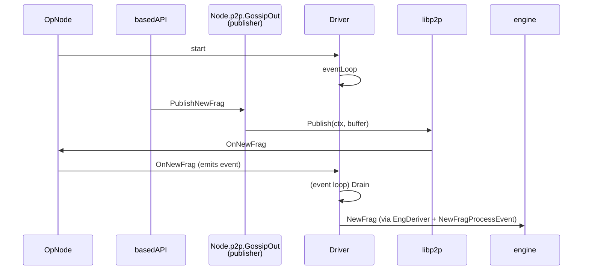

# Based API

The based api is a custom JSON-RPC API used by the gateway to send preconf-related events to an op node. These events are:

- Env: new block metadata. Opens an unsealed block.
- NewFrag: sequence of ordered transactions pre-confirmed by the sequencer. Adds the sequence to the unsealed block.
- Seal: Seals a block with all the new frags within. The result is a full L2 block.

This messages are sent from the gateway to the follower op-node, which on the one hand broadcasts them to peers by gossip, and on the other hand, sends them to the local op-geth via new engine api endpoints so that receipts can be obtained and execution of individual transactions can be performed and validated.

## OP Node Implementation details

The API itself is implemented in `api.go`, and it's added to the common rpc server in `node.go`. This is the same server used by the p2p and admin APIs.

For either frags, seals or envs, the flow is similar.

1. The entrypoint is the rpc handler in `api.go`. The appropriate handler is called by matching the go function name with the json-rpc method name. When a based event is received, it is immediately gossiped out to the p2p network so that other nodes are aware of it. This is via the node p2p interfrace.
2. We use the OpNode (`node.go`) implementation of the interface. The handlers will then call the node's driver callbacks, which will in turn use the driver's emmited to emit an event with a type associated with the message. That is, we will handle the call asynchronously.
3. When the node starts, it's starts the driver, which in turn starts an event loop. A single loop does the following:
   1. Schedules work.
   2. Drains the events emmited and saved.
   3. Selects between many different channels, one of them being a ticker. This ticker ticks once every two seconds, which means that in abscence of events, that's how much a loop will last.
4. When draining events, the frag, seal or env event will be actually handled, so typically we will get these handled once every two seconds.

## New details

Instead of emitting a message to the deriver queue, it would be better to have a separate goroutine to send the engine api calls directly, but whenever certain conditions are satisfied.

- An Env should only be sent to EL if the parent is already sealed.
- A frag should only be sent if the block has been opened with an env.
- A seal should only be sent if the last frag for that block was already sent.
